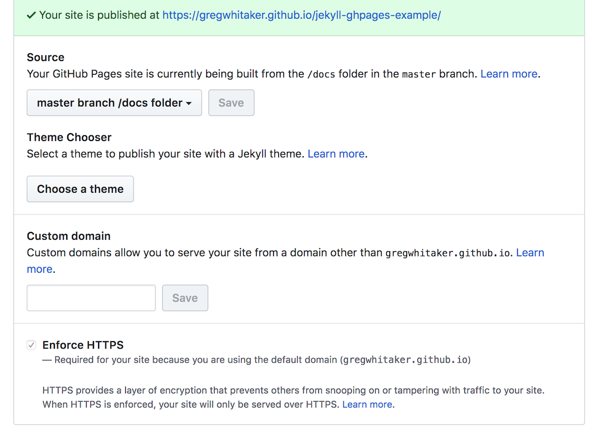

# jekyll-ghpages-example
An example of deploying a Jekyll website to GitHub Pages using Gradle.

## Prerequisites
Serving the example application with Github Pages requires that Github Pages has been activated for the repository and
it is configured to serve content from the `/docs` folder.

## Building the Website
Run the following command to build the website locally:

    ./gradlew jekyllBuild

## Serving the Site Locally
To view website changes locally before committing to Github, run the following command:

    ./gradlew jekyllServe

## Deploying the Website to GitHub Pages
1. Run the following command to deploy website changes to Github Pages:

        ./gradlew jekyllRelease

2. Commit the changes to Github.

## Bugs and Feedback
For bugs, questions and discussions please use the [Github Issues](https://github.com/gregwhitaker/jekyll-ghpages-example/issues).

## License
MIT License

Copyright (c) 2018 Greg Whitaker

Permission is hereby granted, free of charge, to any person obtaining a copy
of this software and associated documentation files (the "Software"), to deal
in the Software without restriction, including without limitation the rights
to use, copy, modify, merge, publish, distribute, sublicense, and/or sell
copies of the Software, and to permit persons to whom the Software is
furnished to do so, subject to the following conditions:

The above copyright notice and this permission notice shall be included in all
copies or substantial portions of the Software.

THE SOFTWARE IS PROVIDED "AS IS", WITHOUT WARRANTY OF ANY KIND, EXPRESS OR
IMPLIED, INCLUDING BUT NOT LIMITED TO THE WARRANTIES OF MERCHANTABILITY,
FITNESS FOR A PARTICULAR PURPOSE AND NONINFRINGEMENT. IN NO EVENT SHALL THE
AUTHORS OR COPYRIGHT HOLDERS BE LIABLE FOR ANY CLAIM, DAMAGES OR OTHER
LIABILITY, WHETHER IN AN ACTION OF CONTRACT, TORT OR OTHERWISE, ARISING FROM,
OUT OF OR IN CONNECTION WITH THE SOFTWARE OR THE USE OR OTHER DEALINGS IN THE
SOFTWARE.